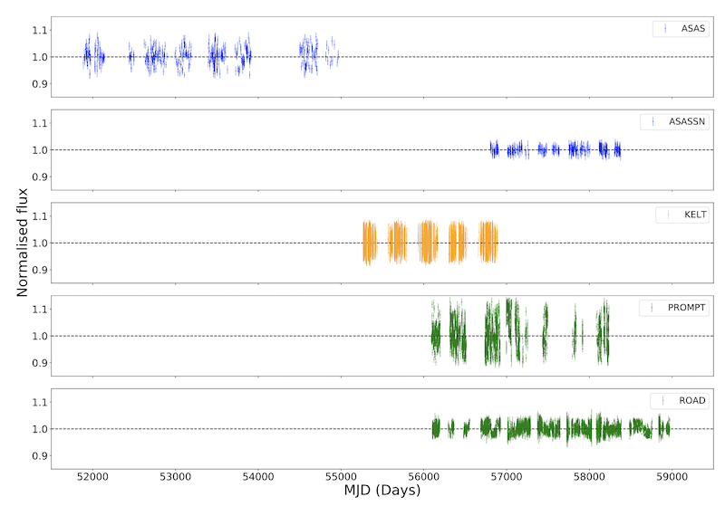
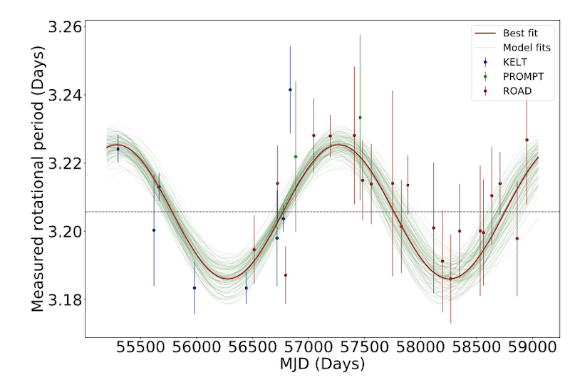
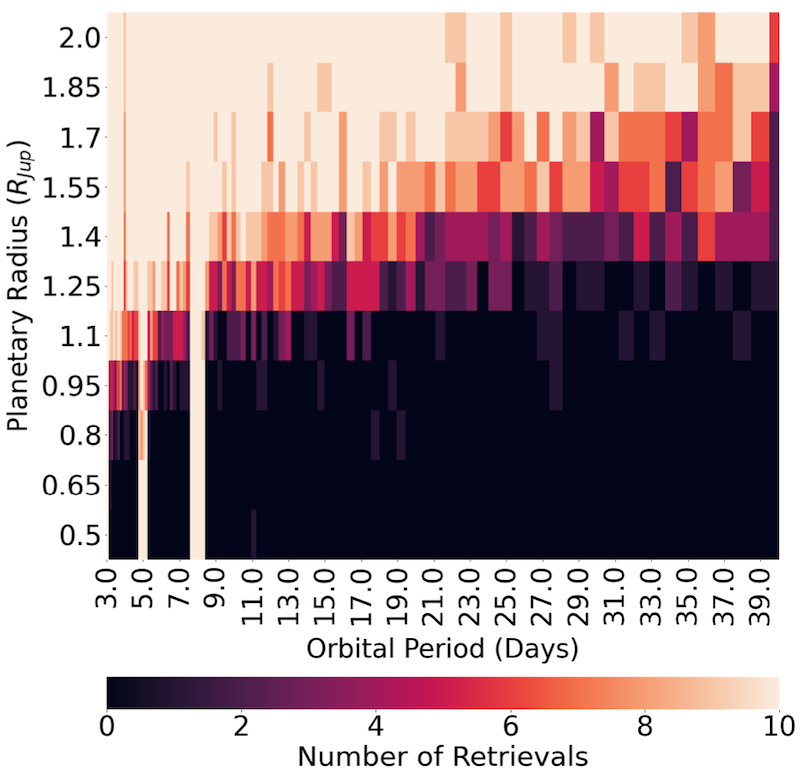

# J1407: removing stellar activity and search for transits

This is a repository for the code used to create the figures in the paper "A search for transiting companions in the J1407 system" by Stan Barmentloo et al. (Astronomy and Astrophysics 2021, accepted).

Timeseries data for the six telescopes considered in the paper is stored in the `Data` directory. 

Arguably the most important data product produced by our research is the combined, 20 year base line ground based telescope activity removed dataset. This data is created in the `Figure_2` directory and stored as `Final_Combined_Data.csv` in the `Data` directory.
The data is sorted per MJD, but the `Telescope` column allows to separate by telescope.

The numbers in this column correspond to the following telescopes:

| telnum | Telescope|
|:------:|:--------:|
| 1      | ASAS     |
| 2      | ASAS-SN  |
| 3      | KELT     |
| 4      | PROMPT   |
| 5      | ROAD     |

Similar results for the TESS data can be found as `Final_TESS_Data.csv` in the `Data` directory and are created in the `Figure_3` directory. 

The `Figure_x` directories are self consistent (together with the data from `Data`) and reproduce each figure from the paper via Jupyter notebooks and Python scripts.

## Generating the CDS tables

The CDS table is written out using `cds.pyreadme` version 1.3.4 from  https://github.com/cds-astro/cds.pyreadme which should be compiled and placed in the `Data/` directory.

